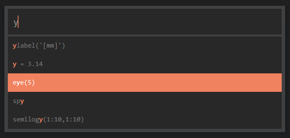
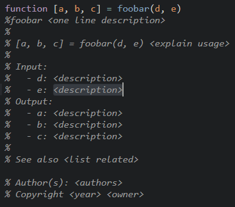
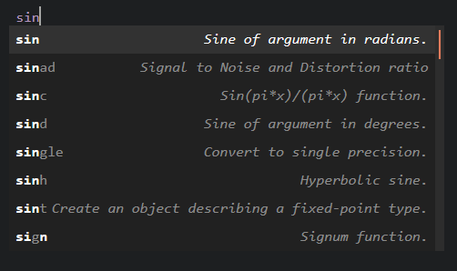
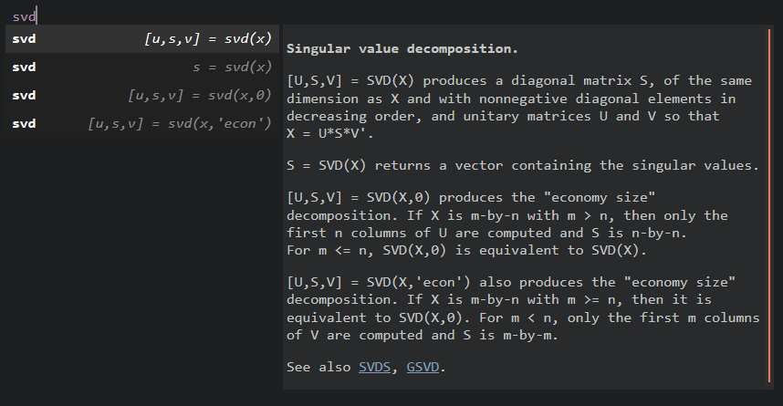

AutoMatlab
==========

AutoMatlab makes writing Matlab code fun again by combine the strengths of Sublime Text with the strengths of Matlab.


__Features__:

- Run Matlab commands from within Sublime Text;
- Generate templated Matlab function documentation;
- Autocomplete any Matlab function.

__Table of Contents__:

[TOC]

Prerequisites
-------------

AutoMatlab currently only supports Matlab installations on *__Windows__*.

AutoMatlab will try to automatically detect your Matlab installation. If Matlab is installed in a non-default location, manually set the paths `matlabroot`, `matlab_pathdef_path` and `matlab_history_path` in the AutoMatlab settings.

AutoMatlab depends on [AutoHotkey](https://www.autohotkey.com/) to send commands to Matlab. To get the full AutoMatlab experience, it's highly recommended to install AutoHotkey. If AutoHotkey is installed in a non-default location, manually set the path `auto_hotkey_path` in the AutoMatlab settings.

Matlab commands
---------------

If [AutoHotkey](https://www.autohotkey.com/) is installed, AutoMatlab can send commands to Matlab, to be run in Matlab's Command Window.

### AutoMatlab Command Panel



The AutoMatlab Command Panel can be accessed through the Sublime Command Palette or via <kbd>Alt + m</kbd>. It shows command suggestions from the recent Matlab history. From this panel, commands can be sent to Matlab:

- <kbd>Enter</kbd> Send the selected history entry.
- <kbd>&rarr;</kbd> Insert the selected history entry into the AutoMatlab Command Panel.
- <kbd>Tab</kbd> Send the AutoMatlab Command Panel input. 

### Predefined commands

A number of useful Matlab commands has been predefined. They can be run through the Sublime Command Palette or via keyboard shortcuts. Some examples:

- <kbd>Ctrl + b</kbd> Run the current file.
- <kbd>Ctrl + Shift + b</kbd> Change the current folder and run the current file.
- <kbd>Alt + .</kbd> Set a breakpoint at the current line.
- <kbd>Alt + ,</kbd> Clear the breakpoint from the current line.

### Custom commands

It is possible to define custom Matlab commands, which can be assigned to keyboard shortcuts or added to the Sublime Command Palette. For custom Matlab commands, use the AutoMatlab command `run_matlab_command` as follows:

```json
{
    "caption": "AutoMatlab: Print status",
    "command": "run_matlab_command",
    "args": {"command": "disp('I am editing file $file at line $line.')"}
}
```

The AutoMatlab command `run_matlab_command` will expand the default Sublime Text variables, such as `$file`, `$file_name`, `$file_base_name`, `$folder`, and `$project_name`. Additionally, AutoMatlab defines the following variables:

- `$line`: The currently active line.
- `$column`: The currently active column.
- `$package_member`: The name of the currently opened Matlab file, including the package namespace.
  Example: `C:\Users\Foo\myproject\+mypack\myfun.m` &rarr; `mypack.myfun`.
- `$package_parent`: The path of the parent directory for the currently opened Matlab package.
  Example: `C:\Users\Foo\myproject\+mypack\myfun.m` &rarr; `C:\Users\Foo\myproject`.

Function documentation generation
---------------------------------

AutoMatlab provides flexible function documentation generation, based on a customizable template snippet. This functionality can be activated  documentation can be generated through the Sublime Command Palette or via the keyboard shortcut <kbd>Ctrl + Alt + m</kbd>.



### Custom template snippet

```xml
<snippet>
<description>Matlab documentation</description>
<content><![CDATA[ 
%${MDOC_NAME} ${1:<one line description>}${MDOC_NAME_MARKER}
%
% ${MDOC_SIGNATURE} ${2:<explain usage>}${MDOC_SIGNATURE_MARKER}
% 
% Input:${MDOC_INARG_BLOCK_MARKER}
%   - ${MDOC_INARG}: ${3:<description>}${MDOC_INARG_MARKER}
%
% Output:${MDOC_OUTARG_BLOCK_MARKER}
%   - ${MDOC_OUTARG}: ${4:<description>}${MDOC_OUTARG_MARKER}
% 
% ${MDOC_ARG_BLOCK_MARKER}
% ${MDOC_ARG}: ${5:<description>}${MDOC_ARG_MARKER}
%
% See also ${6:<list related>}${MDOC_SEE_ALSO_MARKER}

% Author(s): ${7:<authors>}${MDOC_AUTHOR_MARKER}
% Copyright ${8:<year>} ${9:<owner>}${MDOC_COPYRIGHT_MARKER}
]]></content>
<scope>source.matlab</scope>
</snippet>
```

### Project-specific documentation format

Optional entries

```json
{
    "auto_matlab":
    {
        "documentation_upper_case_signature": true,
        "documentation_snippet": "mysnippet.sublime-snippet"
    }
}
```

Autocompletion
--------------

Much better autocompletion than provided in Matlab

- Makes 'See also' links
- Default keybinding for autocomplete: ctrl+space, not alt+/ (might be default in windows anyways?)
- Explain Ctrl+Space.... and that you have to press it twice because of Sublime....






### Matlab autocompletion

Can take a while to finish

Quite some options to play around with the resources

Only includes .m files with a certain documentation quality (according to template)


### Project autocompletion


Optional entries

```json
{
    "auto_matlab":
    {
        "include_dirs": [],
        "exclude_dirs": [],
        "exclude_patterns": [],
        "free_documentation_format": true
    }
}
```

### Current folder autocompletion

### Current file autocompletion

Project and current file autocompletions are refreshed upon save (so not if save is done externally, e.g. in Matlab)
Or also on activation?


Todo
----

- Process class folders (@folders)
- Read class defintions (classdef)
- Produce class documentation from snippets
- Only for windows, not for Mac or Linux
