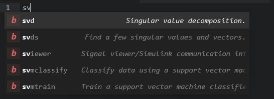
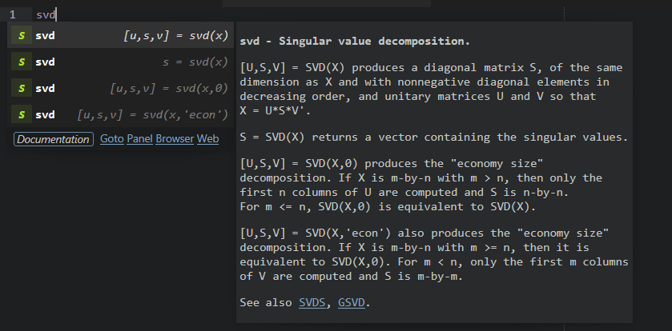
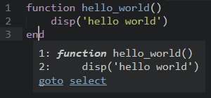

AutoMatlab
==========

AutoMatlab makes writing Matlab code fun again by combining the strengths of Sublime Text with the strengths of Matlab.

__Features__:

- Autocomplete any Matlab function!
- Run Matlab commands from within Sublime Text!
- Generate context-aware Matlab function documentation!

__Table of Contents__:

- [Getting started](#getting-started)
- [Autocompletion](#autocompletion)
    + [Matlab autocompletion](#matlab-autocompletion)
    + [Project autocompletion](#project-autocompletion)
    + [Current folder autocompletion](#current-folder-autocompletion)
    + [Current file autocompletion](#current-file-autocompletion)
- [Matlab commands](#matlab-commands)
    + [AutoMatlab Command Panel](#automatlab-command-panel)
    + [Predefined commands](#predefined-commands)
    + [Custom commands: Matlab Command Window](#custom-commands-matlab-command-window)
    + [Custom commands: Matlab keyboard shortcuts](#custom-commands-matlab-keyboard-shortcuts)
- [Function documentation generation](#function-documentation-generation)
    + [Predefined documentation template snippets](#predefined-documentation-template-snippets)
    + [Custom documentation template snippets](#custom-documentation-template-snippets)
    + [Project-specific documentation format](#project-specific-documentation-format)
- [Extras](#extras)
    + [Open/end statement pairing](#openend-statement-pairing)

Getting started
---------------

- __Autocompletion__
  Works out of the box! Start typing or try pressing <kbd>Ctrl + Space</kbd> to see what it does. If you are interested in more tailored functionality, have a look [here](#autocompletion).
- __Matlab commands__
  Depends on [AutoHotkey](https://www.autohotkey.com/). If AutoHotkey is installed and `auto_hotkey_path` correctly specified in the AutoMatlab settings, try pressing <kbd>Ctrl + b</kbd> to run the current file in Matlab or <kbd>Alt + m</kbd> to open the AutoMatlab Command Panel. If you are interested in more tailored functionality, have a look [here](#matlab-commands). 
- __Function documentation generation__
  Works out of the box! Try pressing <kbd>Ctrl + Alt + m</kbd> in a Matlab function file to see what it does. If you are interested in more tailored functionality, have a look [here](#function-documentation-generation). 

*Note 1: AutoMatlab currently only supports Matlab installations on __Windows__*.
*Note 2: Make sure that the syntax of `.m` files is set to Matlab (by default):*

    View > Syntax (> Open all with current extension as...) > Matlab

Autocompletion
--------------

AutoMatlab offers extensive autocompletion functionalities, which are a substantial improvement over the very limited built-in autocompletion functionalities of the Matlab Editor.

__Features__:

- Autocompletion on multiple levels: Matlab-wide, project-wide, folder-wide, file-wide.
- Customizable autocompletion sources.
- Documentation pop-up similar to Matlab's `help`.
- Responsive `See also` hyperlinks.

Autocompletion suggestions will be automatically shown while typing, but can also be queried via the default keyboard shortcut <kbd>Ctrl + Space</kbd>.



When the typed text exactly matches a function name, querying the autocompletion with <kbd>Ctrl + Space</kbd> yields a list of suggested function signature snippets, as well a pop-up with the function documentation.



### Matlab autocompletion

AutoMatlab comes by default with autocompletion information for about 3000 built-in Matlab functions. As Matlab installations and user preferences differ, this information can be adjusted to a specific Matlab installation via the below steps:

1. Open the AutoMatlab settings:
    - Specify the Matlab installation path via `matlabroot`.
    - (Optional) Specify the `pathdef.m` path via `matlab_pathdef_path`.
    - (Optional) Fine-tune the sources for the autocompletion information in the section `Matlab autocompletion sources`. All fine-tuning options are documented in the default AutoMatlab settings file.
2. Open the Sublime Command Palette:
    - Run `AutoMatlab: Generate Matlab autocompletion information`. AutoMatlab will parse the specified directories, searching for Matlab functions that adhere to the documentation format used by The MathWorks.
    - Wait for the process to finish (see status bar). This can take several minutes, depending on the Matlab installation.
3. Done! The newly generated autocompletion information is stored in `Packages\AutoMatlab\data\matlab_completions`.

### Project autocompletion

AutoMatlab provides autocompletion information for Matlab functions in the currently active Sublime project. AutoMatlab updates this information each time files within the project are saved.

The following settings can be added to the `.sublime-project` file to adapt the autocompletion sources on a per-project basis. These options work identically to the corresponding options in the default AutoMatlab settings file, where they are documented.

```json
{
    "auto_matlab":
    {
        "include_dirs": [],
        "exclude_dirs": [],
        "exclude_patterns": [],
        "free_documentation_format": true
    }
}
```

### Current folder autocompletion

AutoMatlab provides autocompletion information for Matlab functions in the currently opened folder(s). AutoMatlab updates this information each time files inside the folder(s) are saved.

### Current file autocompletion

AutoMatlab provides autocompletion information for local Matlab functions inside the currently opened file. AutoMatlab updates this information each time the file is saved or activated.

Matlab commands
---------------

If [AutoHotkey](https://www.autohotkey.com/) is installed, AutoMatlab can send commands to Matlab, to be run in the Matlab Command Window.

### AutoMatlab Command Panel


The AutoMatlab Command Panel can be accessed through the Sublime Command Palette or via <kbd>Alt + m</kbd>. It shows command suggestions from the recent Matlab history. If no history is shown, make sure `matlab_history_path` is correctly set in the AutoMatlab settings. 

Through the AutoMatlab Command Panel, commands can be sent to Matlab:

- <kbd>Enter</kbd> Run the selected history entry in Matlab.
- <kbd>&rarr;</kbd> Insert the selected history entry into the AutoMatlab Command Panel.
- <kbd>Tab</kbd> Run the input from the AutoMatlab Command Panel in Matlab. 

### Predefined commands

A number of useful commands have been predefined. They can be run through the Sublime Command Palette or via keyboard shortcuts. Some examples:

- <kbd>Ctrl + b</kbd> Run the current file in Matlab.
- <kbd>Ctrl + Shift + b</kbd> Change the current folder and run the current file in Matlab.
- <kbd>Alt + .</kbd> Set a Matlab breakpoint at the current line.
- <kbd>Alt + ,</kbd> Clear the Matlab breakpoint from the current line.

### Custom commands: Matlab Command Window

It is possible to define custom AutoHotkey commands that execute text commands inside the Matlab Command Window. These AutoMatlab commands can be added to the Sublime Key Bindings or to the Sublime Command Palette. To create custom commands for the Matlab Command Window, use the AutoMatlab command `run_matlab_command` as follows:

```json
[
    {
        "caption": "AutoMatlab: Print status",
        "command": "run_matlab_command",
        "args": {"command": "disp('I am editing file $file_name at line $line.')"}
    }
]
```

The AutoMatlab command `run_matlab_command` will expand the default Sublime Text variables, such as `$file`, `$file_name`, `$file_base_name`, `$folder`, and `$project_name`. Additionally, AutoMatlab defines the following variables:

- `$line`: The currently active line.
- `$column`: The currently active column.
- `$package_member`: The name of the currently opened Matlab file, including the package namespace.
  Example: `C:\Users\Foo\myproject\+mypack\myfun.m` &rarr; `mypack.myfun`.
- `$package_parent`: The path of the parent directory for the currently opened Matlab package.
  Example: `C:\Users\Foo\myproject\+mypack\myfun.m` &rarr; `C:\Users\Foo\myproject`.

### Custom commands: Matlab keyboard shortcuts

It is possible to define custom AutoHotkey commands that execute Matlab keyboard shortcuts inside Matlab. These AutoMatlab commands can be added to the Sublime Key Bindings or to the Sublime Command Palette. To create custom commands that run keyboard shortcuts in Matlab, use the AutoMatlab command `run_matlab_command` as follows:

```json
[
    {
        "caption": "AutoMatlab: Stop execution",
        "command": "run_matlab_command",
        "args": {"command": "^c", "type": "key"}
    }
]
```

These commands use the syntax of the `SendInput` function of AutoHotkey. For more details on this syntax, see the sections _Parameters_ and _Key names_ in the AutoHotkey [documentation](https://www.autohotkey.com/docs/commands/Send.htm).

Function documentation generation
---------------------------------

AutoMatlab provides flexible and context-aware function documentation generation, based on a customizable template snippet. Function documentation can be generated through the Sublime Command Palette or via the keyboard shortcut <kbd>Ctrl + Alt + m</kbd>.

### Predefined documentation template snippets

AutoMatlab provides a number of predefined documentation template snippets. These template snippets follow the function documentation format that is employed by The MathWorks: they comprise a one-line function description and at least one function signature. Furthermore, they are adaptive, in the sense that they substitute elements from the function definition into the snippet. 

In the AutoMatlab settings, a predefined documentation template snippet can be selected by setting `documentation_snippet` to one of the following values:

- `matlab_documentation.sublime-snippet` (default)


- `matlab_documentation_args.sublime-snippet`


- `matlab_documentation_args_in_out.sublime-snippet`


### Custom documentation template snippets

AutoMatlab also supports custom documentation template snippets. To create those, start from the below example, add/remove/adapt as desired, and save the result as a `.sublime-snippet` file. Finally, set the `documentation_snippet` in the AutoMatlab settings to the name or path of the created template snippet.

```xml
<snippet>
<description>Matlab documentation</description>
<content><![CDATA[ 
%${MDOC_NAME} ${1:<one line description>}${MDOC_NAME_MARKER}
%
% ${MDOC_SIGNATURE} ${2:<explain usage>}${MDOC_SIGNATURE_MARKER}
% 
% Input:${MDOC_INARG_BLOCK_MARKER}
%   - ${MDOC_INARG}: ${3:<description>}${MDOC_INARG_MARKER}
%
% Output:${MDOC_OUTARG_BLOCK_MARKER}
%   - ${MDOC_OUTARG}: ${4:<description>}${MDOC_OUTARG_MARKER}
% 
% ${MDOC_ARG_BLOCK_MARKER}
% ${MDOC_ARG}: ${5:<description>}${MDOC_ARG_MARKER}
%
% See also ${6:<list related>}${MDOC_SEE_ALSO_MARKER}

% Author(s): ${7:<authors>}${MDOC_AUTHOR_MARKER}
% Copyright ${8:<year>} ${9:<owner>}${MDOC_COPYRIGHT_MARKER}
]]></content>
<scope>source.matlab</scope>
</snippet>
```

### Project-specific documentation format

The following settings can be added to the `.sublime-project` file to adapt the generated function documentation on a per-project basis.

```json
{
    "auto_matlab":
    {
        "documentation_upper_case_signature": true,
        "documentation_snippet": "mysnippet.sublime-snippet"
    }
}
```

Extras
------

### Open/end statement pairing

AutoMatlab recognizes paired open statements (e.g., `if`, `for`, `function`) and end statements. When the cursor is in an open or end statement, the following popup about the paired statement



can be triggered with command:

```json
[
    {
        "caption": "AutoMatlab: Pair open+end statement",
        "command": "pair_matlab_statements",
        "args": {"action": "popup"},
    }
]
```

There are also commands to directly jump between open/end statements or to select all enclosed code:

```json
[
    {
        "caption": "AutoMatlab: Jump open+end statement",
        "command": "pair_matlab_statements",
        "args": {"action": "jump"},
    },
    {
        "caption": "AutoMatlab: Select open+end statement",
        "command": "pair_matlab_statements",
        "args": {"action": "select"},
    }
]
```